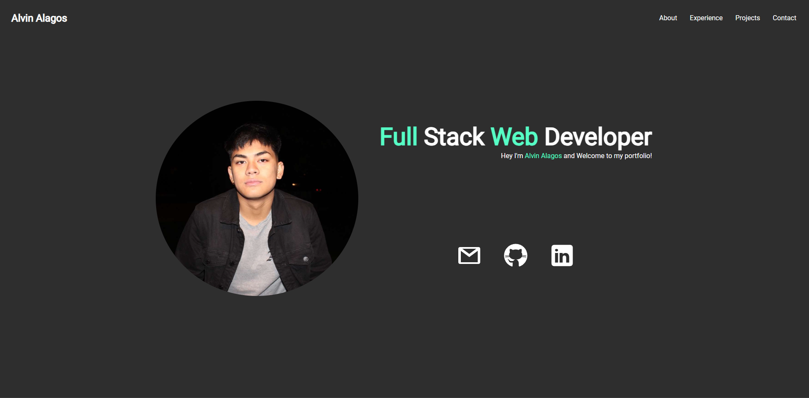

# Thought Process

Initially I was a bit blocked with my creativity, which ended up taking up a chunk of my time assigned for the project. but after drawing up some sketches finally I was able to get going with the development. I looked around other profolios to get a little bit of inspiration, and I wanted this portfolio to represent me as an individual as well. 

I would consider myself as a minimalist so I tried my best to keep it at a minimalist design. I am not best designer/artist so keeping it minimal and clean was probably the best choice. 

Me as a person I like to enjoy stuff and have fun, so I implemented as much animations as I could without making it obnoxious for the user to see. As for color theme, I went with a black and white theme because,those are mostly the main colors I use for my designs since their my favourites. I added as well some greenish accents which would prevent the porfolio from looking to plain.

I feel this portfolio isn't done yet, since there a few minor fixes and changes I still have in mind for. And I'd defintely want to improve the design overall since it still feels a bit plain for me.

Link to portfolio:[(https://project-portfolio-ochre.vercel.app/)](https://project-portfolio-ochre.vercel.app/) 

